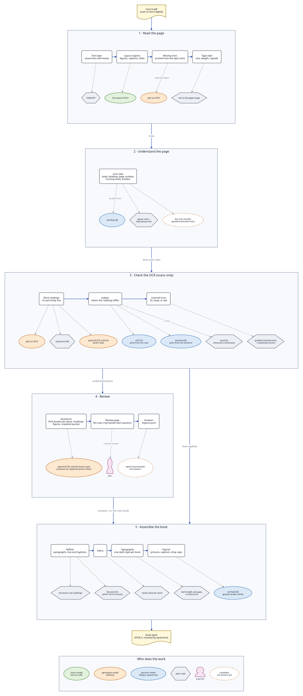

# Roboscriptorium

Turns a book's PDF into a clean EPUB 3, automated as far as possible and running
entirely on local AI (generative and decision models on Ollama).

It takes searchable PDFs (a scan with an OCR text layer, as the Internet Archive
makes them) and born-digital ones (made from the typeset text). An image-only scan,
without a text layer, gets its first reading from tesseract.



The diagram's source is [docs/pipeline.d2](docs/pipeline.d2); render it with
`d2 docs/pipeline.d2 docs/pipeline.svg`.

How it all fits together: [docs/how-it-works.md](docs/how-it-works.md); why each part
is there: [docs/design.md](docs/design.md).

Work in progress. See [AGENTS.md](AGENTS.md) for scope, architecture and conventions.

```sh
uv run roboscriptorium doctor
```
